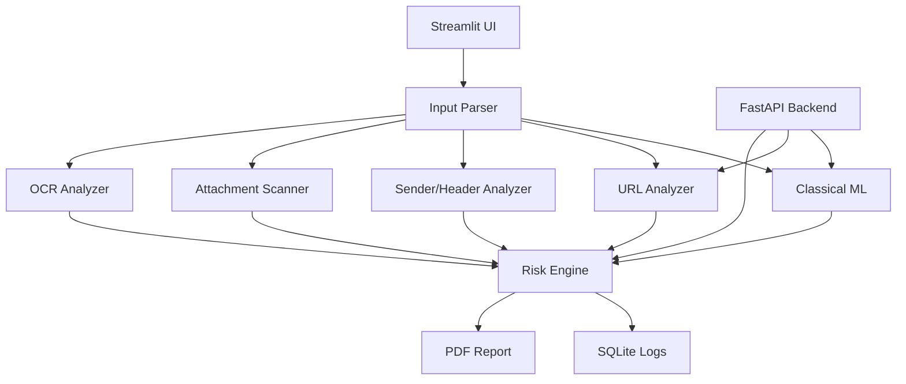

# Architecture

```mermaid
flowchart TD
    A[Streamlit UI] --> B[Input Parser]
    B --> C[Classical ML]
    B --> D[URL Analyzer]
    B --> E[Sender/Header Analyzer]
    B --> F[Attachment Scanner]
    B --> G[OCR Analyzer]
    C --> H[Risk Engine]
    D --> H
    E --> H
    F --> H
    G --> H
    H --> I[SQLite Logs]
    H --> J[PDF Report]
    K[FastAPI Backend] --> C
    K --> D
    K --> H
```

The system separates detection modules so each cybersecurity signal can be tested and improved independently.
